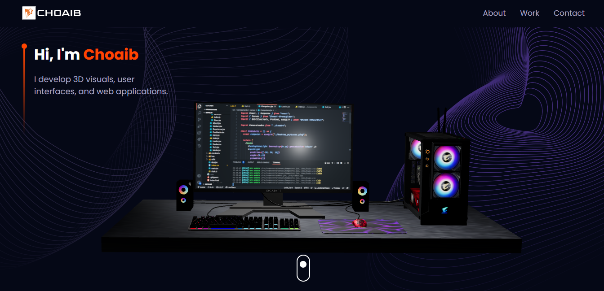
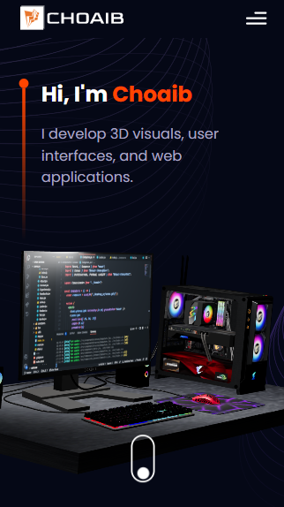

# 3d-portfolio
3D portfolio implemented using react, vite, threejs, react-three/fiber and react-three/drei.

<h2>I'm having a problem in small devices, the model is not showing.</h2>
<h2>If you think you can help, please don't hesitate to fork this.</h2>
<h1>Thanks a lot</h1>

    
    

<h2>It's showen here because this is just google device bar.</h2>
